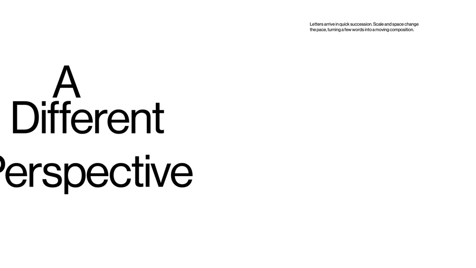
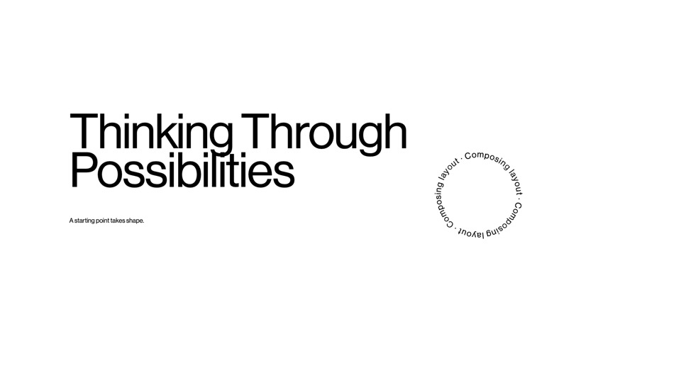
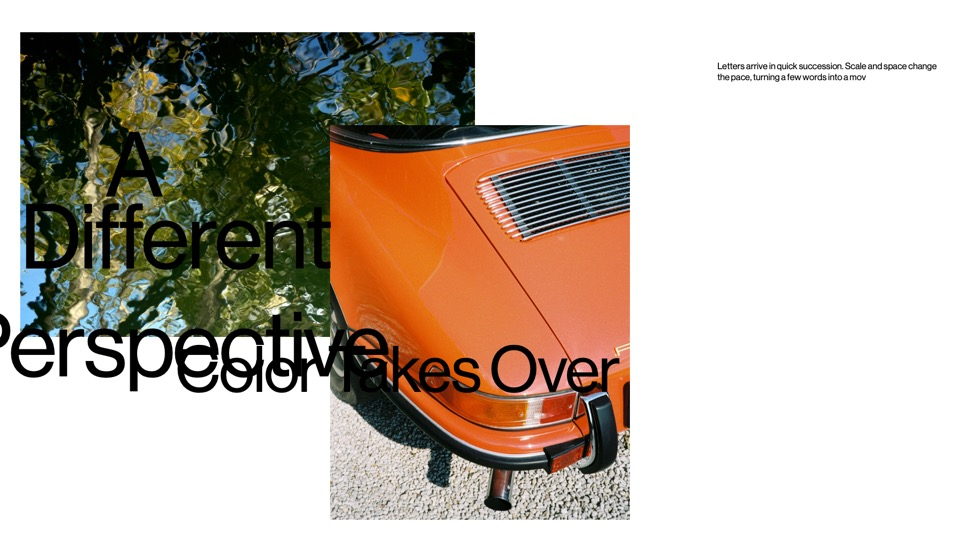
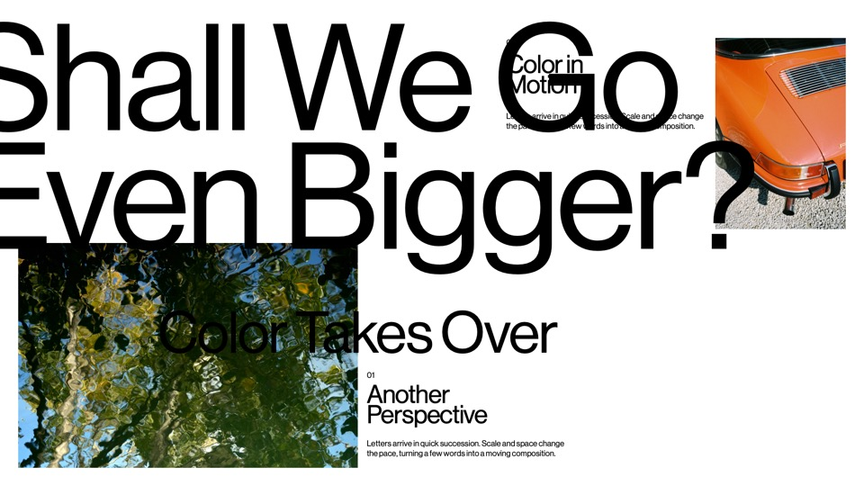
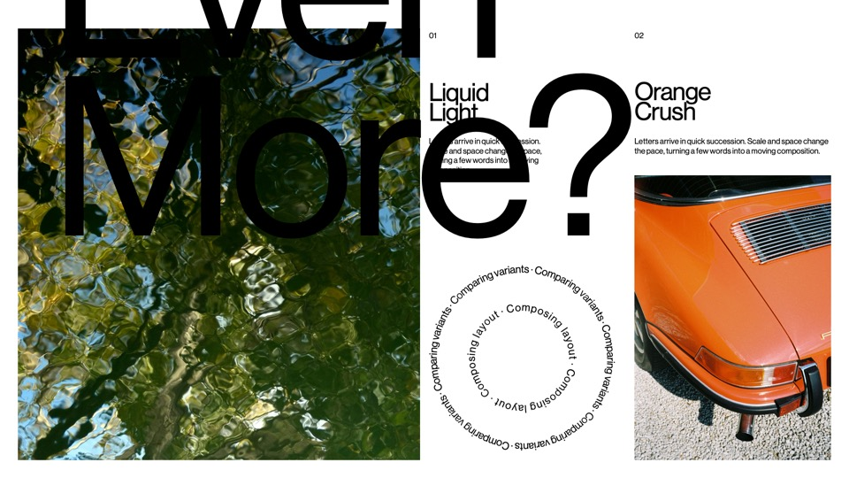
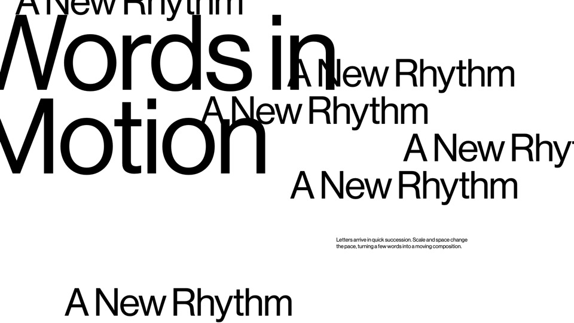
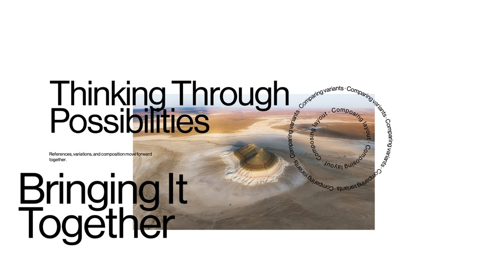
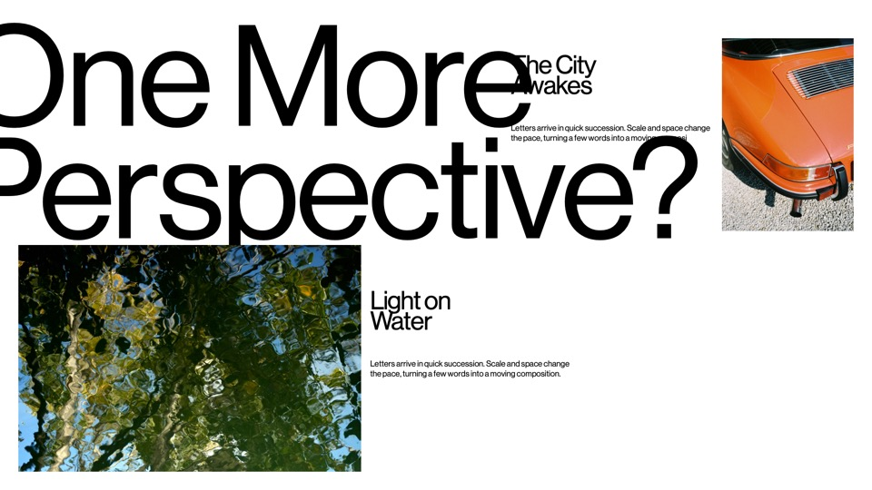

# Demo layout vocabulary

These are reusable composition rules transcribed from the user's existing demo. They are not model training, a slideshow, or generated work status. Apply them to real published results through `scripts/activity.mjs`. Default to the measured ordinary layout for dense content.

## Reference and provenance

The latest local exports are `exports/demo-tape-v6-prompt-paced.mp4` and `exports/demo-tape-v6-4K.mp4`. Their source is `scripts/render-prompt-demo.swift` and `scripts/render-prompt-demo-4k.swift`. The v6 cut frames are 0, 69, 152, 275, 423, 573, 747, and 862 at 30 fps; the last frame is 976. The stills below come from the preceding v5 storyboard with the same eight compositions; v6 changes arrival timing. Original videos, full-resolution renders, fonts, and live activity stay local. The small reference stills are versioned here.

| Scene / v6 start | Composition | Live choice |
| --- | --- | --- |
| 1 / 0.00s | Three staggered lines; body high on the opposite side | `staggered` |
| 2 / 2.30s | Large left headline; concentric status rings on the right | Existing tool lifecycle with actual labels and expiry |
| 3 / 5.07s | Wide upper-left photo plus overlapping portrait; type across images | `photo-stack` |
| 4 / 9.17s | Large lower-left and small upper-right photos with oversized lettering | `overtext` |
| 5 / 14.10s | Six-column lead image, three-column copy, three-column side stack | `editorial` |
| 6 / 19.10s | Oversized headline with staggered repetitions | `type-echo` |
| 7 / 24.90s | Center photo with a large lower-left headline and live work indicator | `photo-hero`; tool lifecycle may coexist |
| 8 / 28.73s | Oversized question plus an opposing photo pair | `overtext` |










## Composition rules

- Use the 1920 × 1080 white artboard, twelve columns, 40 px inset and 20 px gutters. Preserve regular-weight type, −2% title tracking, 80% title leading, and the existing body wrapping rules.
- `staggered`: split the real title into up to three lines with diminishing left offsets. Place a 445 px body measure at the upper right. Intentional edge cropping belongs to display lettering only.
- `photo-stack`: use the latest two published images at (40, 64, 910, 610) and (660, 250, 600, 790). Overlay the actual title; reserve the upper right for copy. With one image, show one; with none, use staggered type.
- `photo-hero`: use the latest photo in a central 1065 × 600 frame. Put the headline across its lower-left area and body at the upper left. With no photo, use staggered type.
- `type-echo`: repeat only the actual event title at staggered positions, never invent extra progress. Decorative copies are hidden from assistive technology. The full title and summary remain accessible once.
- Image frames may cover-crop but never stretch. Long titles shrink and long summaries fall back to ordinary measured sections. No words are discarded to fit a preset.
- A result presentation remains until the next result. Real tool updates overlay it without destroying it. Reconnects replay the same explicit choices; session reset clears them. Keep the original composition under each temporary presentation.
- Keep the existing grapheme typewriter reveal and reduced-motion support. No automatic scene cycling or fabricated workstream labels. Demo source labels are samples only.

The live versions adapt the demo to readable arbitrary content: they do not copy the demo's sample text, arbitrary timing, or every intentional collision. The eight-scene table records the source; four new presets fill the missing vocabulary alongside the existing editorial, overtext, and live-orbit treatments.

## Publish

```sh
node scripts/activity.mjs <<'JSON'
{"kind":"progress","title":"A Verified Result","summary":"Describe what actually happened.","presentation":"staggered"}
JSON
```

Photo presets use the current event's `image` and recent image history. A tool is always `kind: "tool"`; a result is `kind: "progress"`. Use `scripts/live-activity.mjs` only for a real running/completed/failed action with a matching `runId`. Do not run demo-reel scripts in the user's live feed unless asked for a labeled demo.

## Verification

`node --test` checks event persistence, photo selection/fallback, frame bounds, intentional image overlap, ordinary geometry, session preservation, and status lifecycle. Browser checks should cover all four new presets, a subsequent ordinary result, and a tool update that leaves the current presentation intact. Generated videos and local evidence are not required to run the app.
